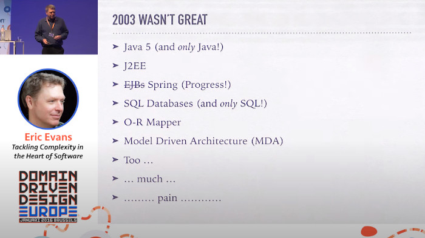
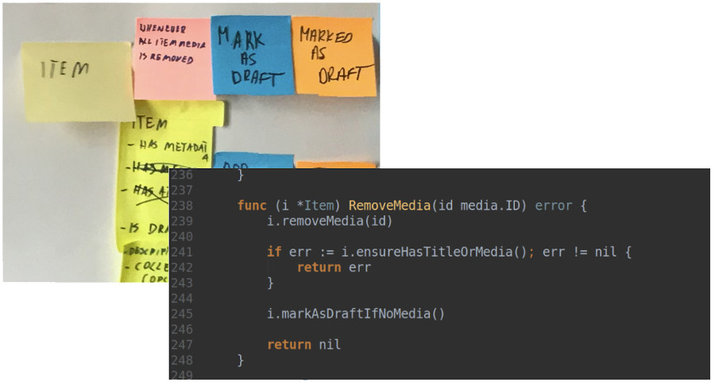
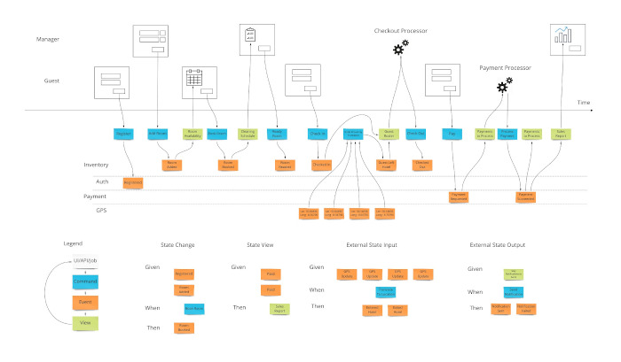
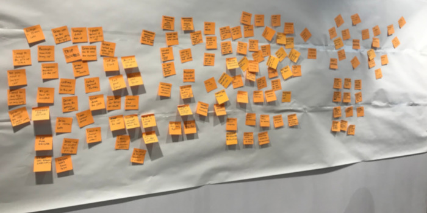
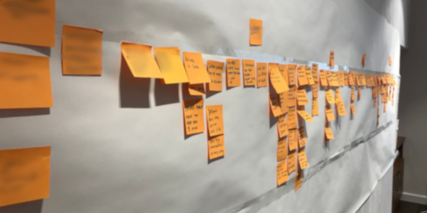

# Тёмные века программного обеспечения

Пару лет назад я работал в SaaS-компании, которая страдала, **пожалуй, от всех возможных проблем, связанных с разработкой программного обеспечения**. Код был настолько сложным, что на внесение простых изменений могли уйти месяцы. Все задачи и рамки проекта определялись только руководителем проекта. Разработчики не понимали, какую проблему они решают. Без понимания ожиданий заказчика многие реализованные функциональные возможности оказывались бесполезными. Команда разработчиков также не могла предложить лучшие решения.

Несмотря на наличие микросервисов, внесение одного изменения часто требовало изменения большинства сервисов. Архитектура была настолько тесно связана, что мы не могли развернуть эти "микросервисы" независимо друг от друга. Бизнес не понимал, почему добавление "_одной кнопки_" может занять два месяца. В итоге заинтересованные стороны перестали доверять команде разработчиков. Мы все были очень расстроены. **Но ситуация не была безнадежной**.

**Мне повезло, что я был немного знаком с Domain-Driven Design**. В то время я ещё не был экспертом в этой области. Но мои знания были достаточно основательны, чтобы помочь компании минимизировать и даже устранить значительную часть упомянутых проблем.

Прошло некоторое время, а эти проблемы не исчезли и в других компаниях. Даже если решение этих проблем существует и не является чем-то заумным. Но люди, похоже, об этом не знают. Может быть, потому, что старые методики, такие как GRASP (1997), SOLID (2000) или DDD (Domain-Driven Design) (2003), часто забываются или считаются устаревшими? Это напоминает мне ситуацию, сложившуюся в исторические "тёмные века", когда древние знания забывались. Точно так же мы можем использовать старые идеи. Они по-прежнему актуальны и могут решать современные проблемы, но их часто игнорируют. **Мы как будто живем в "тёмных веках" программного обеспечения**.

Ещё одно сходство - концентрация внимания на неправильных вещах. В исторические "тёмные века" религия задвигала науку. В "тёмные века" программного обеспечения инфраструктура отбрасывает важные методы проектирования ПО. Я не утверждаю, что религия не важна. Духовная жизнь очень важна, но не тогда, когда вы страдаете от голода и болезней. С инфраструктурой дело обстоит точно так же. **Наличие потрясающего кластера Kubernetes и самой навороченной инфраструктуры микросервисов не поможет вам, если ваш программный дизайн - отстой**.

## Тёмные века программного обеспечения, как системная проблема

**Тёмные века программного обеспечения (Software Dark Ages) - это очень сильная самовоспроизводящаяся система**. Невозможно решить системную проблему, не понимая общей картины. _Системное мышление_ - это техника, которая помогает анализировать такие сложные проблемы. Я использовал эту технику для визуализации "тёмных веков" программного обеспечения.

[Смотреть полную версию](https://threedots.tech/post/software-dark-ages/system-thinking.jpg)

Вы видите одну большую петлю, состоящую из вещей, которые ускоряют друг друга. Без вмешательства проблемы становятся всё больше и больше. Как же Domain-Driven Design может это исправить?

В отличие от большинства известных гуру программирования, мы не хотим, чтобы вы просто поверили в нашу историю. Мы могли бы просто выдумать её. **К счастью, мы можем объяснить, почему это работает, с помощью науки**. Точнее, с помощью замечательной книги "_Accelerate: The Science of Lean Software and DevOps_", основанной на научных исследованиях. В исследовании, описанном в книге, упоминаются характеристики лучших и худших команд. Одним из наиболее важных факторов является слабосвязанная архитектура.

**Если вы думаете, что микросервисы могут дать вам слабосвязанную архитектуру, то вы сильно ошибаетесь**. Я неоднократно видел микросервисы, которые были более связаны, чем монолит. Вот почему нам нужно нечто большее, чем просто инфраструктурные решения. Именно в этот момент на помощь приходит Domain-Driven Design (DDD).

> Это ключевое архитектурное свойство позволяет командам легко тестировать и развёртывать отдельные компоненты или сервисы даже по мере роста организации и количества эксплуатируемых ею систем, т.е. позволяет организациям повышать производительность по мере масштабирования.
>
> (...)
>
> Использование самой современной архитектуры микросервисов, развернутой на контейнерах, не гарантирует повышения производительности, если игнорировать эти характеристики.
>
> (...)
>
> Архитектурные подходы, позволяющие реализовать эту стратегию, включают использование ограниченных контекстов и API как способ разделения больших доменов на более мелкие, слабосвязанные единицы, а также использование тестовых двойников и виртуализации как способа изолированного тестирования сервисов или компонентов.
>
> _Accelerate: The Science of Lean Software and DevOps_

## DDD не работает

Может быть, вы знаете кого-то, кто пробовал DDD, но у него ничего не получилось?

Может быть, вы работали с человеком, который не очень хорошо в этом разбирался, пытался навязать эти методы и делал всё слишком сложным?

Может быть, вы видели в Twitter, что какой-то известный инженер-программист сказал, что DDD не работает?

Может быть, для вас это легендарный Святой Грааль, который, как утверждает кто-то, работает, но никто его ещё не видел.

Не будем забывать, что мы живем в "тёмные века" программного обеспечения. Есть одна проблема с идеями из предыдущей эпохи - есть вероятность, что некоторые люди могут упустить исходную точку DDD. Это неудивительно в контексте 2003 года, когда DDD был предложен впервые.

Войти в мир DDD не так-то просто. Многие книги и статьи упускают наиболее важные моменты DDD, чрезмерно упрощая их. Кроме того, они часто объясняются на абстрактных примерах, оторванных от реальности. Также нередко встречаются слишком длинные и сложные примеры, которые невозможно понять.

Попробую объяснить DDD самым простым способом.

## От тёмных веков до эпохи Возрождения

Техники DDD можно разделить на две части. Тактические и стратегические паттерны. Тактические паттерны Domain-Driven Design - это то, **как** реализовать решение в коде. В тактическом DDD нет никакой ракетотехники - всё дело в хороших практиках объектно-ориентированного программирования. Но прежде чем писать код, необходимо знать, **что** реализовать. Вот тут-то и вступают в игру стратегические паттерны DDD.

Во многих источниках, описывающих DDD, большая часть времени уделяется тактическим паттернам. Иногда они даже пропускают стратегические паттерны. **Вы можете практиковать DDD, используя только стратегические паттерны**. В некоторых проектах использование тактических паттернов DDD даже излишне. К сожалению, **большинство людей поступают совершенно противоположным образом**. **Они используют только тактические паттерны без стратегической части**. **Это просто ужасно**.

Если бы меня спросили, существует ли какая-нибудь "серебряная пуля" в разработке программного обеспечения, я бы назвал только одного кандидата: _стратегические паттерны Domain-Driven Design_. Стратегическое DDD помогает нам получить ответы на вопросы о том:

- **какую проблему вы решаете?**
- **будет ли ваше решение соответствовать ожиданиям заинтересованных сторон и пользователей?**
- **насколько сложен проект?**
- **какие функции не являются необходимыми?**
- **как разделить сервисы для поддержки быстрой разработки в долгосрочной перспективе?**

Эти вопросы очень важны при реализации нового проекта, добавлении новой функциональности или проведении рефакторинга. **Стратегические паттерны DDD дают нам возможность последовательно и предсказуемо отвечать на эти вопросы**.

Некоторые инженеры говорят мне, что они "просто инженеры". Их не слишком волнует, кто и зачем использует их программное обеспечение. Они просто реализуют, скажем, задачи JIRA - строят сервисы с некоторым количеством байтов на входе и некоторым количеством байтов на выходе. Такой образ мышления приводит к большому разрыву между инженерами и их клиентами, проблемы которых мы, инженеры, пытаемся решить. Без правильной коммуникации гораздо сложнее создавать решения, которые помогут клиентам. А ведь именно в этом, в конечном счёте, и состоит цель - не просто обрабатывать байты.

Очень заманчиво потратить небольшое количество времени на фазу планирования проекта. Начать кодирование как можно раньше и закончить раньше. Когда у кого-то возникают подобные сомнения, я люблю говорить: "_За 5 дней кодирования можно сэкономить 1 день планирования_". Незаданные вопросы не исчезнут по волшебству.

Лучший способ преодолеть "тёмные века" программного обеспечения - это атаковать его с разных сторон. Давайте посмотрим, как паттерны DDD могут атаковать систему.

[Смотреть полную версию](https://threedots.tech/post/software-dark-ages/system-thinking-solved.jpg)

### Событийный штурм

Событийный штурм (Event Storming) - это переломный момент для стратегических паттернов DDD и разработки программного обеспечения в целом. **Я не могу поверить, почему он ещё не принят всеми командами в мире**.

**Event Storming - это семинар, в ходе которого люди с вопросами (часто разработчики) встречаются с людьми с ответами (часто заинтересованными сторонами). В ходе сессии они могут быстро изучить сложные бизнес-области**. Вначале вы сосредотачиваетесь на построении полностью рабочего потока, основанного на _событиях домена_ (оранжевые липкие заметки). Event Storming - очень гибкий метод. Благодаря этому вы можете проверить, соответствует ли ваше решение ожидаемым требованиям. В зависимости от цели сессии можно также изучить поток данных, потенциальные проблемы или UX.

**Проверка того, что в решении нет пробелов и оно соответствует запросам пользователей, занимает считанные минуты**. **Внесение изменений и проверка идей в разработанном и развернутом коде стоит гораздо дороже**. **Замена липкой записки на доске обходится очень дёшево**.

Инженер-строитель или инженер-ракетчик может быстро увидеть результат ошибки. Они могут увидеть, что что-то явно не так, ещё не закончив процесс строительства. С программным обеспечением всё не так просто, потому что его не так легко увидеть. Большинство наших критических решений никому не повредит. Проблемы с разработкой и сопровождением функций не возникнут за один день.

Event Storming работает, когда вы планируете **как большой проект, так и просто одну историю**. Всё зависит от того, сколько времени вы хотите потратить. Когда мы используем его для одной истории, это может быть от 10 минут до пары часов. Для более крупной функциональности мы обычно тратим от одного дня до нескольких дней.

После сессии у вас должны быть правильные ответы на вопросы о том:

- **какие проблемы вы пытаетесь решить** - вместо того, чтобы гадать, что может быть полезно конечному пользователю, или считать, что "_мы знаем всё лучше_",
- **довольны ли заинтересованные стороны предложенным решением** - вместо того, чтобы проверять это через полгода после внедрения,
- **сложность проблемы хорошо видна** - становится понятно, почему добавление одной кнопки может потребовать огромного количества работы,
- **первоначальное представление о том, как можно разделить микросервисы по обязанностям** - вместо того, чтобы слепо группировать "похожие вещи".

В итоге вы получите гораздо больше **доверия со стороны заинтересованных сторон**, потому что вы планируете решение **вместе**. Это гораздо лучший подход, чем изолированное кодирование в подвале.

Замечательным в Event Storming является то, что результат правильно проведённой сессии может быть отображен непосредственно в коде. Это поможет вам избежать многих дискуссий в процессе разработки и значительно ускорит работу.

Начинать нужно с чёткой цели. Время в проекте может лететь незаметно, и не успеешь оглянуться, как уже полгода потрачено на проект, а он никому не нужен. Приходилось ли вам сталкиваться с подобным? Это случается чаще, чем вы думаете, и именно поэтому некоторые люди теряют доверие к "инженерам", и мы можем оказаться в роли разработчиков, не имеющих никакой самостоятельности.

Обычно мы боимся, сколько времени нам нужно "потерять" на выполнение сессии. **Думать о потере времени на проведение сессии - неправильный подход**. **Вместо этого следует подумать о преимуществах, которые вы потеряете, если не будете проводить сессию**. Я слышал историю, когда проведение одной сессии Event Storming остановило реализацию проекта на пару месяцев. Это может показаться плохим, но в ходе сессии команда обнаружила, что текущие предположения совершенно не соответствуют действительности. Продолжение проекта привело бы к полному провалу. Даже если в краткосрочной перспективе сессия может показаться трудоёмкой, компания избежала нескольких месяцев бесполезной разработки.

### Событийное моделирование

В 2018 году Адам Даймитрук предложил технику событийного моделирования (Event Modeling). Нотация и идея в значительной степени основаны на технике Event Storming, но добавляют несколько новых возможностей. Кроме того, в ней делается дополнительный акцент на UX-части сессии.

В целом, эти техники вполне совместимы. Даже если вы остановитесь на Event Storming, вы можете найти некоторые ценные подходы из Event Modeling, которые вы можете использовать.

Подробнее об этой технике можно прочитать на сайте [eventmodeling.org](https://eventmodeling.org/posts/what-is-event-modeling/).

### Ограниченный контекст и границы транзакций (агрегаты)

**Ограниченный контекст (Bounded Context) - это ещё один стратегический паттерн DDD, который помогает нам разбивать большие модели на более мелкие логические части**.

Он является ключевым для достижения **правильного** разделения сервисов. Если для реализации и тестирования новой функциональности необходимо затронуть половину системы, значит, разделение выполнено неправильно.

Альтернативой неправильному разделению является отсутствие разделения. Часто симптомом отсутствия разделения являются объекты-боги (огромные объекты, которые знают слишком много или делают слишком много). В этом случае изменения коснутся в основном одного сервиса. Цена такого подхода - повышенный риск сбоя большой системы и повышенная сложность изменений.

Другими словами - в обоих случаях развивать проект будет сложнее.

Отличным инструментом, помогающим обнаружить _ограниченный контекст_ и _агрегаты_, является (конечно же) Event Storming.

В результате сессии вы сможете наглядно увидеть, как следует разделить ваши сервисы и точки соприкосновения между ними.

### Всеобщий язык

**Всеобщий язык (Ubiquitous Language) - это стратегический паттерн DDD, который охватывает построение общего языка между разработчиками, операторами, заинтересованными сторонами и пользователями**. Это **самый недооцененный паттерн стратегического DDD**. Ведь кого волнует язык, верно?

Мне потребовалось время, чтобы понять, **как много проблем в общении между разработчиками и не-разработчиками возникает из-за использования разных языков**. И насколько это болезненно. Я бы посоветовал и вам обратить на это внимание. Из-за недопонимания **разработчики не решают нужные задачи, поскольку никто не понимает, чего от них хотят**.

Удивитесь ли вы, если я скажу, что Event Storming поможет вам разработать всеобщий язык? Проведение сессии вместе с заинтересованными сторонами заставляет вас разговаривать с ними. **Трудно строить решение вместе, если вы не можете понять друг друга**. Поэтому очень важно не упустить заинтересованные стороны на семинаре!

## Решает ли DDD все проблемы?

Даже если DDD - это здорово, он не решает всех проблем, которые у нас есть. Важно управлять своими ожиданиями. **Даже если в моей команде мы используем эти техники на высоком уровне, мы всё равно сомневаемся, достаточно ли хорош созданный дизайн**. Иногда мы не знаем, как подойти к решению проблемы. Иногда мы возвращаемся от кода к фазе проектирования. Иногда мы принимаем неверные решения. **Всё это вполне нормальные ситуации**. **В мире нет ни одной команды, в которой не было бы таких проблем**. **Лучше предположить, что это произойдёт, и не удивляться**. Но мы знаем, что без DDD эти проблемы были бы гораздо более существенными.

При использовании DDD следует уделять особое внимание тому, чтобы их избежать:

- сначала большой дизайн,
- реализации кода "на будущее",
- попытки создать что-то идеальное,

Вместо этого следует:

- **Сосредоточьтесь на том, чтобы предоставить MVP пользователю в короткие сроки** (под короткими сроками я подразумеваю скорее 1 месяц, чем 6 месяцев).
- **Если вам нужно реализовать что-то "на будущее", потому что потом это будет сложнее добавить** - это очень плохой знак. Вам следует подумать о том, как сделать так, чтобы это было легко добавить позже.
- **Смиритесь с тем, что даже если вы сделаете всё возможное, ваш дизайн не будет идеальным с самого начала** - гораздо лучше улучшать его со временем.

Некоторым командам может потребоваться много работы, чтобы выйти на этот уровень. Но я могу пообещать вам, основываясь на своём опыте, что это возможно. А удовольствие, которое вы получите от повторной поставки программного обеспечения, того стоит!

> Если вы считаете, что для того, чтобы предлагать такие улучшения, нужно быть техническим лидером, то вы ошибаетесь! На первых порах, когда я ещё не был лидером, я уже предлагал множество улучшений в командах, в которых работал. Нужно иметь хорошие аргументы с коллегами по команде.
>
> В своих статьях мы всегда объясняем, "почему" те или иные приёмы работают. Когда вы будете использовать эти аргументы, их должно быть достаточно, чтобы убедить их. Если это не сработает из-за того, что ваша команда придерживается закрытых взглядов, это хороший повод задуматься о смене работы.

## Возрождение программного обеспечения

В рамках одной статьи трудно очень глубоко разобраться с представленными методиками. Моей целью было скорее вдохновить вас на то, чтобы поставить под сомнение существующее положение вещей. **Наша отрасль не должна работать именно так**. **Если вас не устраивает существующее положение вещей, надеюсь, что я вдохновил вас на изучение новых методик**. Это лучший способ борьбы с "тёмными веками" программного обеспечения.

Если вы хотите узнать о тактических паттернах DDD, вам следует ознакомиться с нашими [предыдущими статьями](https://threedots.tech/tags/ddd/).

Примеры написаны на языке Go, но их можно легко перенести на любой язык. Кроме того, у Go очень низкая точка входа. Кто знает, может быть, вы найдете новый любимый язык? 😉

**Кто вы в тёмные века программного обеспечения?**

Обычный провинциал, который слепо следует правилам, навязанным другими?

Инквизитор, пытающийся возненавидеть и задушить любой нестандартный подход?

Алхимик, пытающийся создать золото? Даже если это не подкреплено научными данными?

А может быть, вы тайно читаете запрещённые книги в своём подвале? Может быть, вы вместе с нами стремитесь покончить с "тёмными веками" программного обеспечения и начать "Возрождение программного обеспечения"?

Сообщите нам об этом в комментариях!
